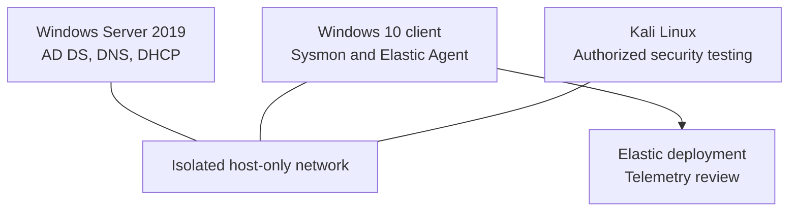
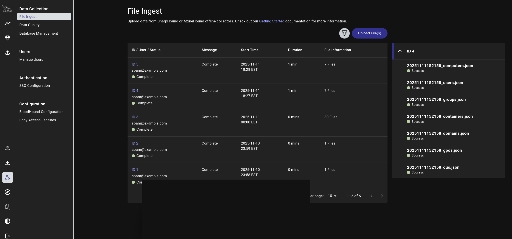
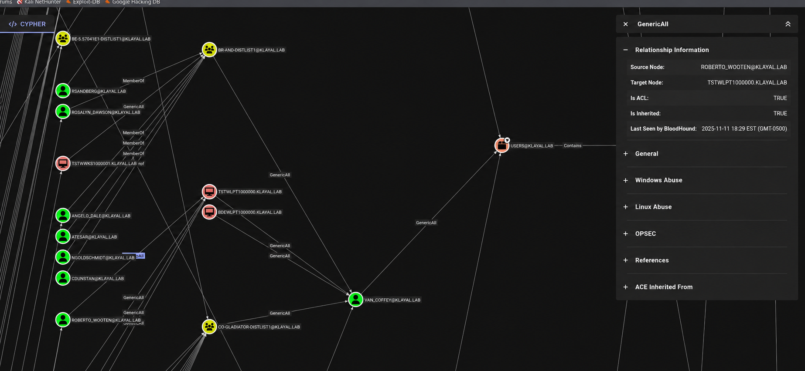

# Active Directory Security Lab: Attack Paths, Credential Abuse and Detection

Designed and built an isolated Active Directory environment to map identity attack paths, test credential-abuse techniques, collect endpoint telemetry, and develop defensive recommendations. The project combines Windows domain administration, BloodHound graph analysis, BadBlood-generated misconfigurations, Sysmon, Elastic, and controlled offensive testing.

> All activity was performed in a personally controlled lab. Credentials, hashes, student identifiers, and original course materials are intentionally excluded.

## Project highlights

- Engineered a multi-VM Active Directory range with Windows Server 2019, a domain-connected Windows endpoint, Kali Linux, AD DS, DNS, DHCP, and isolated VMware networking.
- Generated an enterprise-scale test dataset with more than 1,000 randomized directory users plus groups, OUs, computers, memberships, and intentionally unsafe ACL relationships.
- Executed SharpHound collection against the owned `KLAYAL.LAB` domain, ingested seven directory-data files into BloodHound, and mapped multi-hop privilege paths toward Tier Zero assets.
- Instrumented the Windows endpoint with Sysmon and Elastic Agent, then validated centralized process and host telemetry.
- Executed controlled password spraying, AS-REP roasting, Kerberoasting, and LSASS-dump tests, then correlated the activity with Windows Security and Sysmon telemetry.
- Developed detection hypotheses and remediation priorities for privileged-group changes, sensitive ACL modification, credential attacks, legacy authentication, and suspicious process activity.

## Lab architecture



The lab used private addressing on an isolated VMware host-only network. Internet access was enabled only when needed for installation or updates.

## Investigation workflow

| Phase | What was done | Evidence |
| --- | --- | --- |
| Build | Configured the domain controller, Windows client, DHCP, and isolated network | [Lab architecture](docs/01-lab-architecture.md) |
| Populate | Used BadBlood to generate realistic users, groups, OUs, computers, and unsafe ACL relationships | [Lab architecture](docs/01-lab-architecture.md) |
| Collect | Generated and successfully ingested SharpHound computer, container, domain, GPO, group, OU, and user data | [Attack-path analysis](docs/02-attack-path-analysis.md) |
| Map | Ingested directory data and inspected potential paths to privileged objects in BloodHound | [Attack-path analysis](docs/02-attack-path-analysis.md) |
| Observe | Installed Sysmon, enrolled an Elastic Agent, and reviewed endpoint events | [Detection and telemetry](docs/03-detection-and-telemetry.md) |
| Test | Performed password spraying, AS-REP roasting, Kerberoasting, LSASS dumping, and controlled Pass-the-Hash exercises | [Credential-security testing](docs/04-credential-security-testing.md) |
| Detect | Developed Elastic KQL and Splunk SPL hunting queries for identity and endpoint behaviors | [Detection queries](detections/README.md) |
| Improve | Converted findings into preventive and detective controls | [Remediation](docs/05-remediation.md) |

## Representative evidence

### BloodHound path analysis



SharpHound collection from the owned domain produced seven object datasets that BloodHound accepted successfully before path analysis began.



The graph was used to reason about how control of one object could create a route toward more privileged identities or groups. A displayed relationship is a potential path requiring validation; it is not proof that the full chain was executed.

### Endpoint telemetry


Sysmon Event ID 1 supplied process, parent-process, command-line, user, integrity-level, and hash context for endpoint analysis.

### Elastic ingestion


The Windows endpoint was enrolled through Elastic Agent, and generated activity was visible in the log data view.

### Attack-to-event correlation


Repeated Event ID 4625 records showed failed authentication activity generated during the authorized password-spraying test. Additional Kerberos and process evidence is documented in [Credential-security testing](docs/04-credential-security-testing.md).

## Tools and technologies

- Windows Server 2019, Active Directory Domain Services, DNS, DHCP
- Windows 10, Sysmon, Windows Event Viewer
- VMware host-only networking
- Kali Linux
- BadBlood, SharpHound, BloodHound
- Elastic Agent and Elastic Stack
- Atomic Red Team, Impacket, Mimikatz, ProcDump, Rubeus, Hashcat, CrackMapExec, and Metasploit (controlled lab exercises)

## Key findings

1. Excessive ACL rights can turn ordinary accounts or computers into stepping stones toward high-value directory objects.
2. Group nesting and object placement make privilege relationships difficult to assess manually; graph analysis helps expose indirect paths.
3. Credential material remains valuable even without recovering plaintext passwords, making credential protection and administrative tiering essential.
4. Endpoint telemetry is useful only when it is collected, forwarded, and reviewed with enough context to distinguish expected activity from suspicious behavior.
5. Security controls such as Microsoft Defender can interrupt testing; failed attempts are still useful evidence when their cause and defensive significance are documented accurately.

## Validation notes

BloodHound relationships were analyzed as potential attack paths and checked against their graph semantics; the repository does not equate a displayed path with successful exploitation of every edge. Password spraying, AS-REP roasting, Kerberoasting ticket retrieval, and a ProcDump-based LSASS dump succeeded in the lab. Kerberoasting ticket cracking was not completed, and live Mimikatz access attempts that failed or were blocked are not presented as successful compromises.

## Repository structure

```text
active-directory-attack-defense-lab/
├── README.md
├── docs/
│   ├── 01-lab-architecture.md
│   ├── 02-attack-path-analysis.md
│   ├── 03-detection-and-telemetry.md
│   ├── 04-credential-security-testing.md
│   └── 05-remediation.md
├── detections/
│   └── README.md
├── evidence/
│   ├── active-directory-population.png
│   ├── bloodhound-path-analysis.png
│   ├── bloodhound-privileged-relationships.png
│   ├── asrep-event-4768.png
│   ├── elastic-agent-status.png
│   ├── elastic-event-ingestion.png
│   ├── kerberoast-event-4769.png
│   ├── lsass-sysmon-event-1.png
│   ├── password-spray-event-4625.png
│   ├── sharphound-file-ingestion.png
│   └── sysmon-process-creation.png
├── .gitignore
└── SECURITY.md
```

## Author

Kundan Layal  
[GitHub](https://github.com/Kundanlyl) | [LinkedIn](https://www.linkedin.com/in/kundan-layal-b3a074216)
