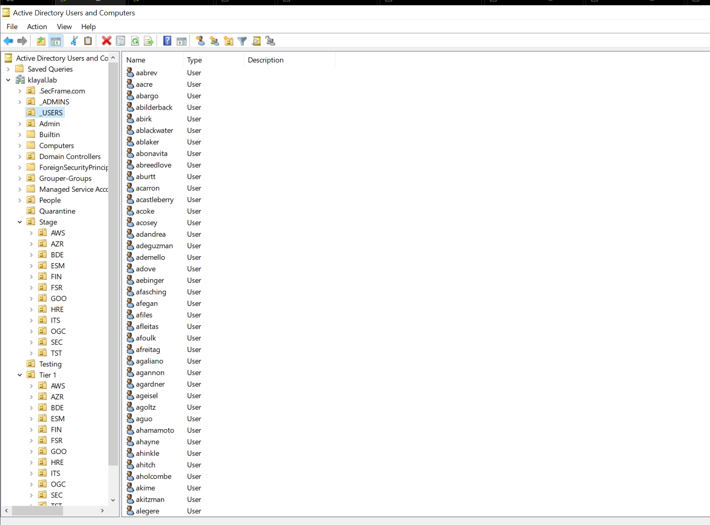

# Lab Architecture

## Purpose

The environment was designed to provide a controlled place to administer Active Directory, introduce realistic identity misconfigurations, generate endpoint activity, and evaluate both attack paths and defensive visibility.

## Components

| Component | Role |
| --- | --- |
| Windows Server 2019 | Domain controller providing AD DS, DNS, and DHCP for `KLAYAL.LAB` |
| Windows 10 client | Domain-connected endpoint used for Sysmon and Elastic Agent telemetry |
| Kali Linux | Non-domain testing system used only for authorized lab activity |
| VMware host-only network | Private network segment connecting the virtual machines |
| Elastic deployment | Central view for endpoint events forwarded by Elastic Agent |

## Directory population

BadBlood was used to generate a large, intentionally vulnerable directory dataset. It created randomized users, groups, organizational units, computers, memberships, and access-control relationships. This made it possible to examine indirect privilege paths that would be difficult to reproduce in a small manually created domain.

## Boundaries and limitations

- The systems and identities were lab assets rather than production users.
- Private IP addresses and hostnames in screenshots belong only to the isolated environment.
- Some setup required temporary internet access for installation; testing itself remained confined to the controlled lab.
- The repository omits passwords, NTLM material, student identifiers, and the full original submissions.

