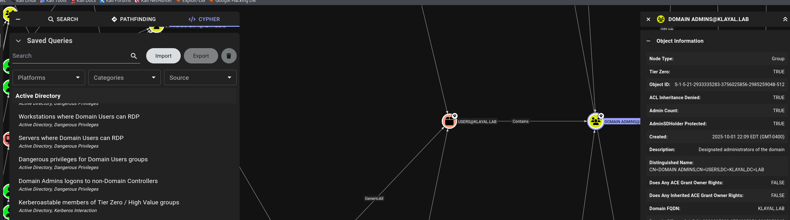

# BloodHound Attack-Path Analysis

## Objective

The objective was to turn raw directory relationships into an identity-risk assessment: identify multi-hop routes from ordinary identities or computers toward privileged Active Directory objects, validate what each edge represents, and convert the findings into remediation priorities.

## Method

1. Collected directory relationship data from the owned lab using SharpHound.
2. Ingested the resulting dataset into BloodHound.
3. Reviewed paths to high-value and Tier Zero objects.
4. Examined relationships such as group membership, `GenericAll`, `WriteDACL`, `WriteOwner`, and `GenericWrite`.
5. Traced longer paths beginning with lower-privileged objects rather than documenting only direct control over a privileged group.

## Analysis example

The analysis mapped a route involving an ordinary user, an intermediate computer object, another user identity, and progressively more sensitive directory objects. This demonstrated how a seemingly isolated delegated permission can become a meaningful escalation path when chained with other control relationships.

This graph should be interpreted carefully:

- BloodHound identifies permissions and possible attack-path edges.
- An edge represents a potential capability, not proof that exploitation succeeded.
- Every relationship should be validated against the underlying ACL, group membership, session, or ownership data.
- Container membership by itself does not mean the container can modify every object it contains; the effective permissions must be verified.

## Privileged relationships

The privileged-object view highlights how direct membership and object-control rights can converge on Domain Admins. This provided a starting point for prioritizing ACL review and reducing unnecessary administrative relationships.

## Relevant ATT&CK concepts

The lab most directly relates to these ATT&CK techniques at a conceptual level:

- **T1087.002 - Account Discovery: Domain Account** for enumerating domain identities.
- **T1069.002 - Permission Groups Discovery: Domain Groups** for identifying domain group relationships.
- **T1482 - Domain Trust Discovery** only when trust relationships are actually enumerated; it should not be used as a label for group modification.
- **T1098 - Account Manipulation** where an attacker uses obtained rights to alter accounts or group membership.
- **T1078.002 - Valid Accounts: Domain Accounts** where compromised domain credentials are used for access.

These mappings describe behavior that the observed permissions could enable. They do not imply that every technique was executed.

## Result

The exercise demonstrated how graph-based analysis can reveal indirect identity risk and why organizations should prioritize effective permissions, nested groups, delegated administration, service accounts, and Tier Zero boundaries during Active Directory reviews.
