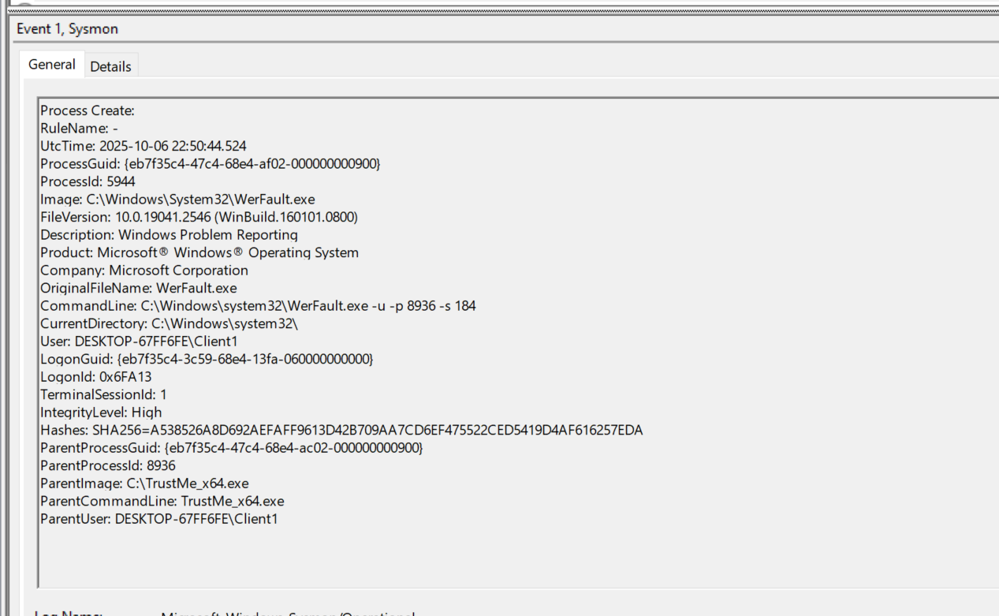
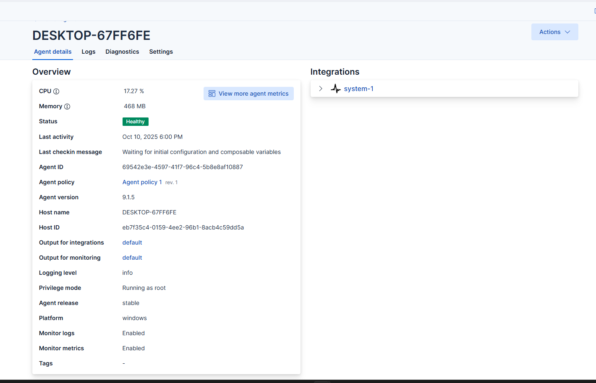
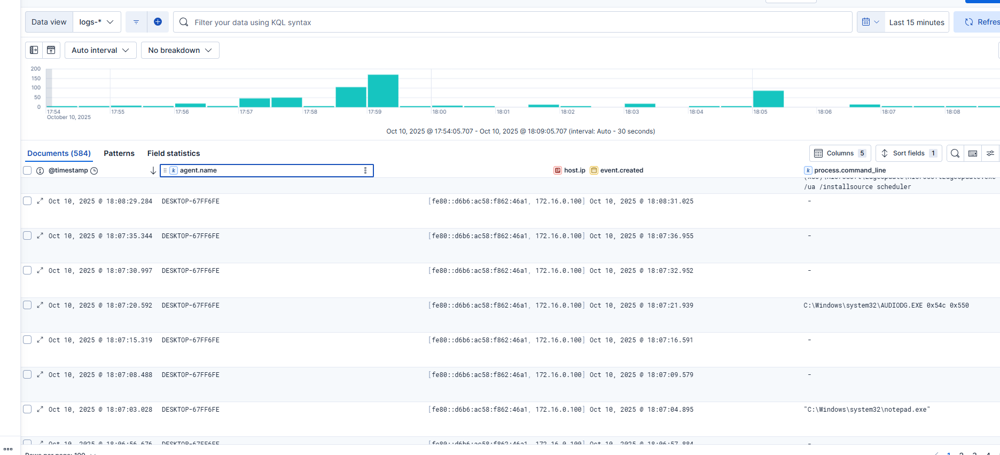

# Detection and Telemetry

## Sysmon validation

Sysmon was installed on the Windows client and validated using process activity. Event ID 1 provided process-creation details including the executable image, command line, parent process, user context, integrity level, and file hash.

This telemetry can support investigations by answering questions such as:

- Which executable ran?
- What parent process launched it?
- Under which account and integrity level did it run?
- What command-line arguments were supplied?
- Does the recorded hash match a known or previously observed file?

## Elastic Agent enrollment

The Windows client was enrolled in Elastic Agent with system log collection enabled.

## Centralized review

Generated endpoint activity was visible in Elastic's data view, allowing events to be filtered by agent, host, time, IP address, and process information.

## Detection engineering

The telemetry review was extended into concrete Elastic KQL and Splunk SPL hunt logic for the following behaviors. The full queries and triage notes are available in [`detections/README.md`](../detections/README.md).

| Data source | Detection opportunity |
| --- | --- |
| Windows Security logs | Repeated logon failures, unusual logon types, special-privilege assignments |
| Kerberos events | Abnormal service-ticket volume, unusual encryption types, service-account activity |
| Sysmon process creation | Suspicious parent-child relationships, encoded commands, credential-access tooling |
| Directory Service Changes | Unexpected group-membership, ACL, ownership, or account changes |
| Endpoint protection | Blocked malware, credential-dumping detections, tamper attempts |

The queries are documented as starter hunts rather than production alerts. Production deployment would require schema validation, baselining, false-positive measurement, threshold tuning, and repeatable test cases.
