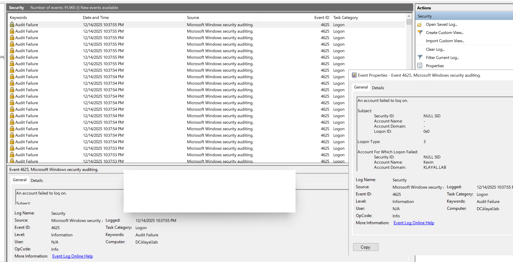
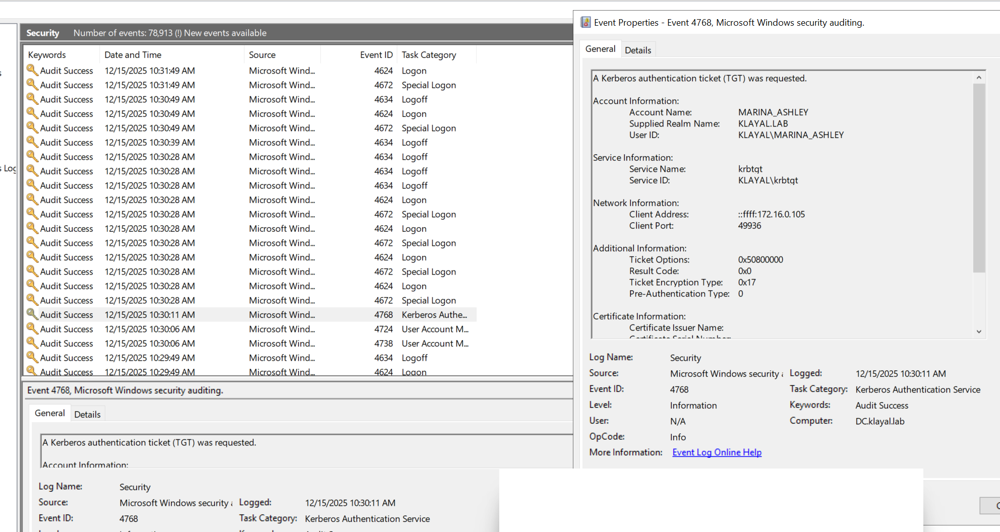
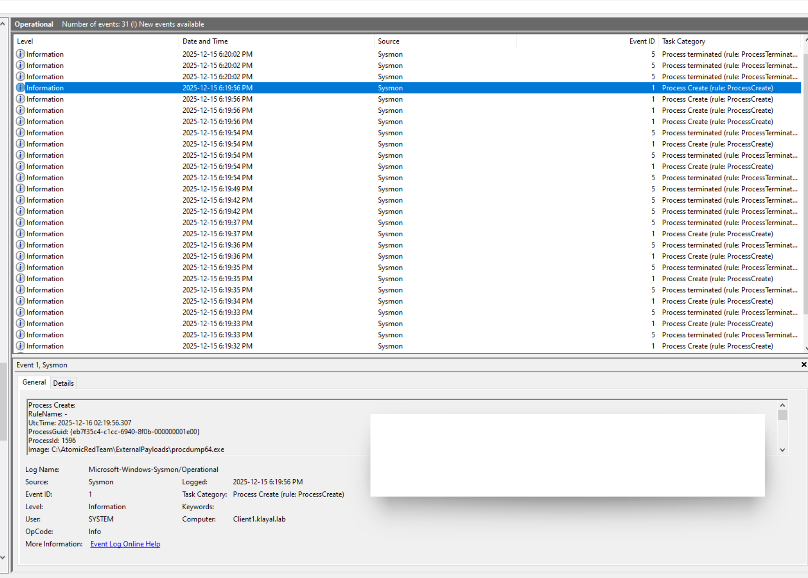
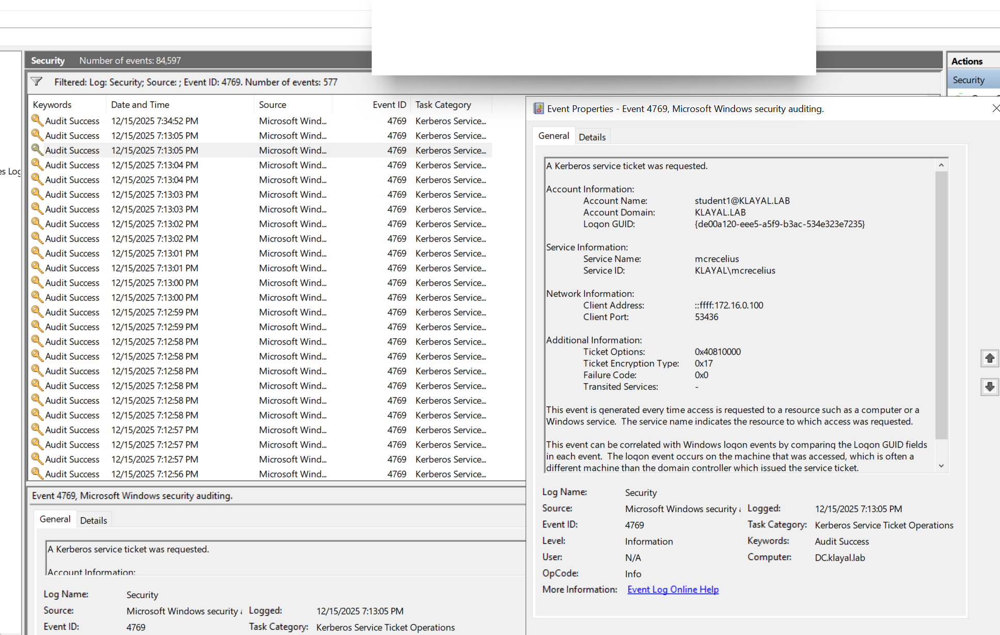

# Credential-Security Testing and Event Correlation

## Scope

Credential testing was performed only against accounts and hosts created for the isolated lab. Sensitive output is omitted from this public portfolio.

## Password spraying

A controlled password-spraying test generated authentication attempts across multiple synthetic domain accounts. The successful test demonstrated how a shared or predictable password can expose several identities while distributing attempts across accounts.

The domain controller recorded repeated failed logons as Windows Security Event ID 4625. A practical detection should aggregate failures by source address over a short interval and count distinct targeted accounts rather than alerting on each event independently. This exercise maps to MITRE ATT&CK technique **T1110.003 — Password Spraying**.

## AS-REP roasting

Accounts configured without Kerberos preauthentication were enumerated in the lab. After correcting an expired-password condition on the test identity, an AS-REP response was retrieved and analyzed offline with Hashcat.

Event ID 4768 showed a ticket-granting-ticket request with preauthentication type `0`, which is a useful indicator when the affected account is not expected to have preauthentication disabled. The event also used RC4 (`0x17`) in this lab. This exercise maps to **T1558.004 — AS-REP Roasting**.

## LSASS credential-dump simulation

Atomic Red Team technique **T1003.001 — LSASS Memory** was run with ProcDump against the owned Windows endpoint. The test produced an LSASS dump for offline examination. Separate attempts to access LSASS directly with Mimikatz were unsuccessful or interrupted by endpoint protections and are not represented as successful.

Sysmon Event ID 1 captured the `procdump64.exe` process, including its image path, user context, integrity level, parent process, and command line. In a production rule, process creation should be correlated with access to `lsass.exe`, dump-file creation, and endpoint-security alerts.

## Kerberoasting

Atomic Red Team technique **T1558.003 — Kerberoasting** was used to request service tickets for accounts with service principal names. Ticket material was retrieved successfully; offline cracking was not completed because of time and compute constraints.

The domain controller generated Event ID 4769 records, including a burst of service-ticket requests using RC4 encryption (`0x17`). RC4 alone is not proof of Kerberoasting, so the hunt should also consider request volume, distinct service names, source host, account baseline, and whether RC4 is expected in the environment.

## NTLM and Pass-the-Hash exercises

- Extracted credential material from an authorized Windows lab system and performed offline NTLM hash analysis with Hashcat.
- Examined how password reuse produces identical NTLM hashes and increases the impact of credential compromise.
- Constructed a controlled Pass-the-Hash test and exercised SMB-based lateral-movement behavior with Metasploit.
- Treated the Windows target's access denial as evidence of control effectiveness rather than claiming successful lateral movement.

## Security lessons

1. Authentication attacks are easier to distinguish when endpoint and domain-controller telemetry are reviewed together.
2. NTLM material can be abused without recovering the plaintext password, while password reuse increases its reach.
3. Kerberos preauthentication and modern ticket encryption reduce exposure to offline password attacks.
4. Offline cracking avoids online account-lockout controls, so password length and uniqueness remain important.
5. Credential Guard, LSASS protection, Microsoft Defender, remote-administration controls, and network segmentation materially change an attacker's options.
6. Failed testing remains useful when it demonstrates control effectiveness and is documented accurately.

## Evidence policy

Screenshots that exposed reusable lab passwords, raw credential hashes, or ticket material are intentionally excluded. The retained images show defensive telemetry rather than authentication material.
